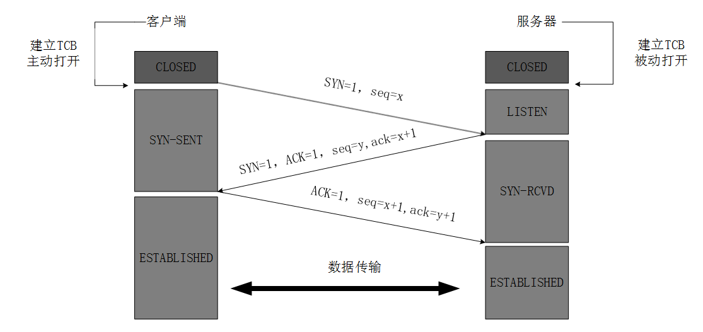

首先，先认识一下握手挥手中用到的一些标识位和缩写的含义：

SYN：为1时，表示新建一个连接

FIN：为1时，表示断开一个连接

ACK：为1时，表示响应成功

seq：顺序号码

ack：确认号码，一般为收到的seq + 1

## TCP三次握手

为什么需要三次握手：客户端和服务器都需要知道双方可收发，因此需要三次握手（让我知道你已经知道了）

如果已经建立了连接，但客户端突然出现故障怎么办？

TCP设有一个保活计时器，服务器每收到一次客户端的请求后都会重新复位这个计时器，时间通常设置为2h，若2h之内还没有收到客户端的任何数据，服务器就会发送一个探测报文，之后每隔75s发送一次。若连续发送10个探测报文仍没有回应，服务器就认为客户端出现故障，接着就关闭连接。

## TCP四次挥手

为什么需要四次挥手：关闭连接时，服务器收到客户端关闭连接的FIN报文时仅仅表示对方不再发送数据但仍能接受数据，而自己的数据也未必全部发送给对方了，所以此时发送完数据给对方后，再向客户端发送FIN报文来表示同意现在关闭连接，ACK和FIN的分开发送导致挥手比握手多了一次。