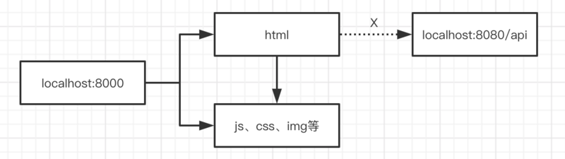

## 跨域是什么


突破同源策略 === 跨域


## 跨域的方法有哪些


### 1. JSONP


原理：JSONP主要就是利用了script标签没有跨域限制的这个特性来完成的。


流程：

1. 前端定义解析函数（例如 jsonpCallback=function(){....}）

2. 通过 params 形式包装请求参数，并且声明执行函数(例如 cb=jsonpCallback)

3. 后端获取前端声明的执行函数（jsonpCallback），并以带上参数并调用执行函数的方式传递给前端。


限制：仅支持GET方法


### 2. CORS（Cross-origin resource sharing，跨域资源共享）


CORS可以告诉浏览器，我俩是一家的，不要阻止他


相比于JSONP只能发送GET请求，这是一种比较好的跨域的方式


其实jack.com后端只需要在响应体里设置：


\```js

response.setHeader('Access-Control-Allow-Origin', 'http://flinn.com')

\```

这样flinn.com就可以访问了


### 3. Nginx 反向代理


比如我要在localhost:8000上访问到localhost:8080上的数据，可以如下图设置代理


配置nginx

```
server {
        listen 80;
        server_name local.test;
        location /api {
            proxy_pass http://localhost:8080;
        }
        location / {
            proxy_pass http://localhost:8000;
        }
}
```


### 4. Node正向代理


代理的思路为，利用服务端请求能跨域的特性，让接口和当前站点同域。


代理前：




代理后：

